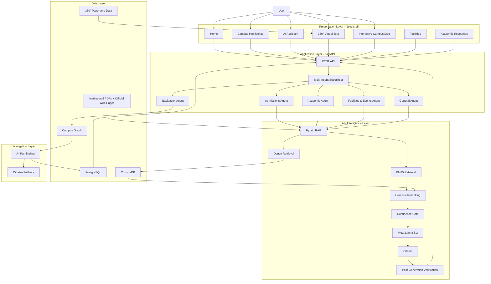
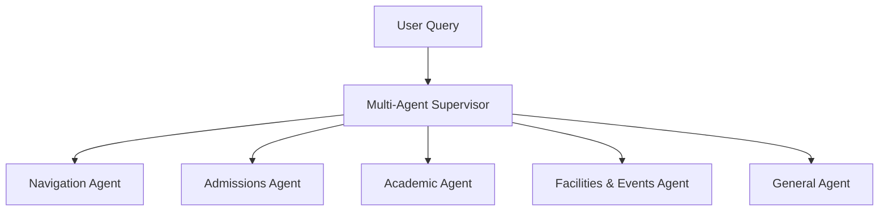
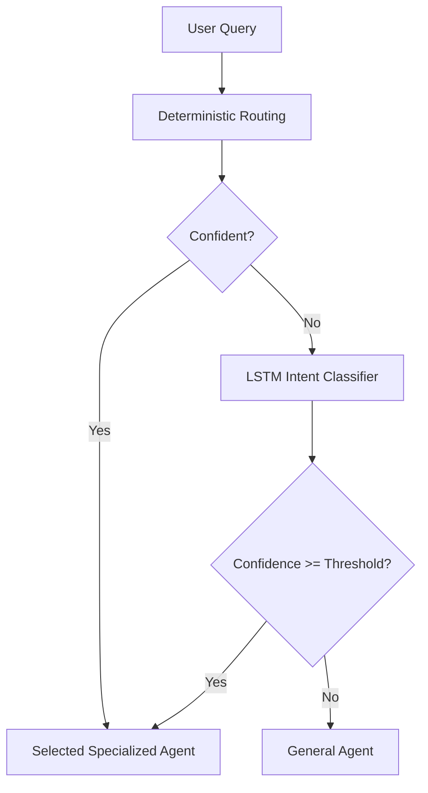
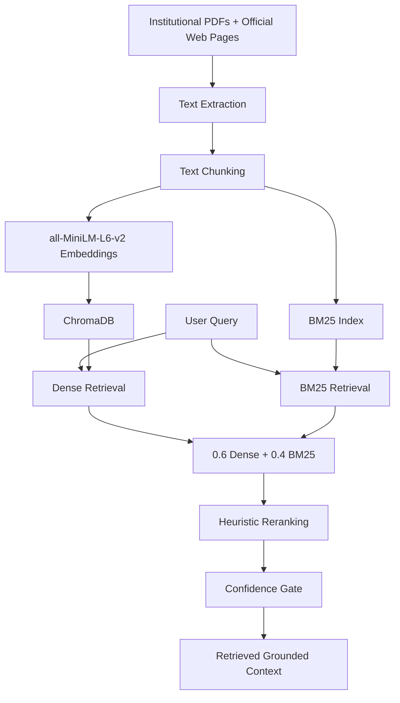
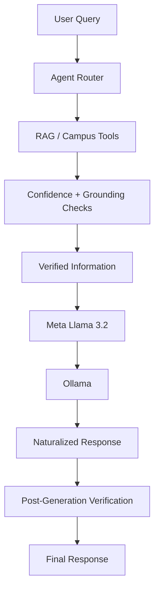
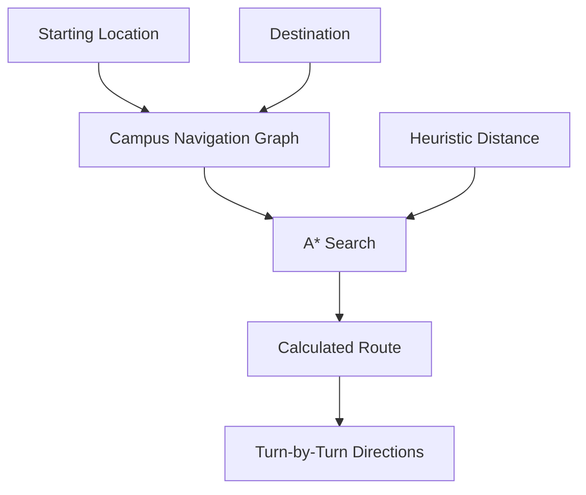
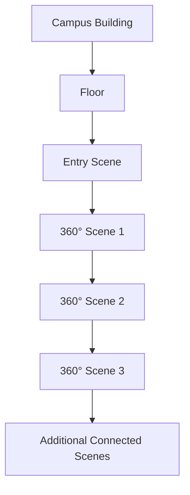
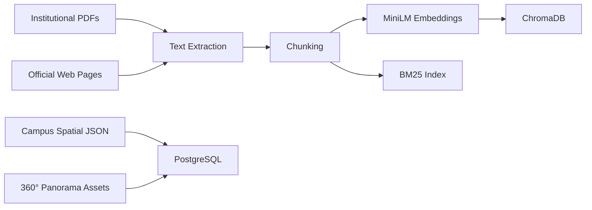
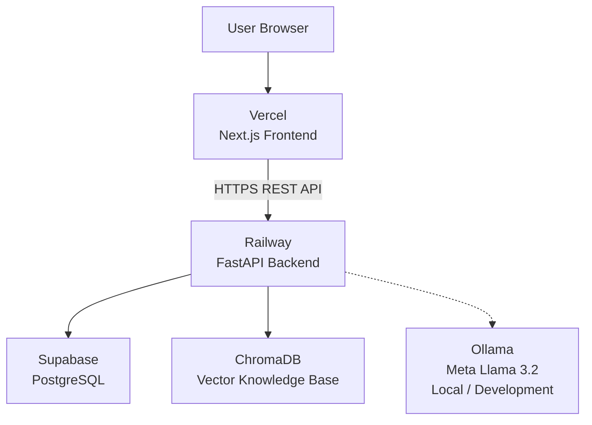
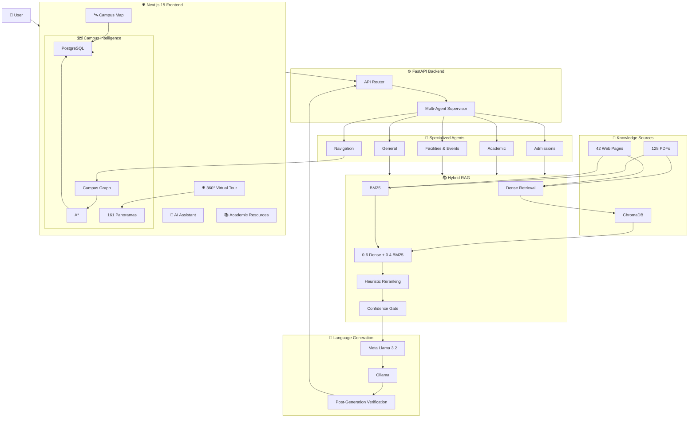

# AI Agent–Driven Smart Campus Assistant with Immersive Virtual Tour Navigation

<p align="center">
  <strong>
    An intelligent smart-campus platform combining AI agents, Hybrid RAG,
    grounded question answering, immersive 360° virtual navigation,
    indoor A* pathfinding, and interactive campus exploration.
  </strong>
</p>

<p align="center">
  🌐 <a href="https://gat-ai-virtual-campus.vercel.app/">Live Application</a>
  &nbsp;&nbsp;•&nbsp;&nbsp;
  💻 <a href="https://github.com/harsha282004/GAT-AI-Virtual-Campus">GitHub Repository</a>
</p>

---

## 📌 Table of Contents

- [Overview](#-overview)
- [Problem Statement](#-problem-statement)
- [Proposed Solution](#-proposed-solution)
- [Key Objectives](#-key-objectives)
- [Complete System Architecture](#-complete-system-architecture)
- [End-to-End System Flow](#-end-to-end-system-flow)
- [AI Query Processing Pipeline](#-ai-query-processing-pipeline)
- [Multi-Agent Architecture](#-multi-agent-architecture)
- [Agent Routing Strategy](#-agent-routing-strategy)
- [Retrieval-Augmented Generation](#-retrieval-augmented-generation-rag)
- [Hybrid Retrieval Pipeline](#-hybrid-retrieval-pipeline)
- [Confidence Gating](#-confidence-gating)
- [Grounded LLM Generation](#-grounded-llm-generation)
- [Post-Generation Verification](#-post-generation-verification)
- [Indoor Navigation](#-indoor-navigation)
- [360° Virtual Campus Tour](#-360-virtual-campus-tour)
- [Interactive Campus Map](#-interactive-campus-map)
- [Campus Intelligence Hub](#-campus-intelligence-hub)
- [Academic Information System](#-academic-information-system)
- [Campus Facilities](#-campus-facilities)
- [Campus Updates](#-campus-updates)
- [Unified User Experience](#-unified-user-experience)
- [Database Architecture](#-database-architecture)
- [Data and Knowledge Pipeline](#-data-and-knowledge-pipeline)
- [Technology Stack](#-technology-stack)
- [Deployment Architecture](#-deployment-architecture)
- [Project Scale](#-project-scale)
- [Project Structure](#-project-structure)
- [API Architecture](#-api-architecture)
- [Implementation Workflow](#-implementation-workflow)
- [Local Installation](#-local-installation)
- [Environment Variables](#-environment-variables)
- [Testing and Verification](#-testing-and-verification)
- [Unique Features](#-unique-features)
- [Limitations](#-limitations)
- [Future Work](#-future-work)
- [Design Philosophy](#-design-philosophy)
- [Live Project](#-live-project)
- [License](#-license)

---

# 📌 Overview

The **AI Agent–Driven Smart Campus Assistant with Immersive Virtual Tour Navigation** is an intelligent web-based smart-campus platform designed to provide a unified digital experience for exploring, understanding and navigating a university campus.

The project combines **Artificial Intelligence, Retrieval-Augmented Generation, multi-agent systems, machine learning, graph-based navigation, 360° visualization, spatial data and full-stack web development** into a single platform.

The implementation is based on **Global Academy of Technology (GAT), Bengaluru**, using institutional information, official web resources, campus spatial data, navigation graphs and 360° panoramic imagery.

The platform allows users to:

- Ask campus-related questions using natural language.
- Retrieve information from institutional knowledge sources.
- Get grounded AI responses.
- Discover academic programmes and resources.
- Explore campus buildings and facilities.
- View an interactive satellite campus map.
- Navigate through indoor campus locations.
- Find routes using A* pathfinding.
- Explore the campus through connected 360° panoramic scenes.
- Move between information, navigation and virtual exploration without switching between separate applications.

The overall user experience can be summarized as:

> **Ask → Discover → Navigate → Explore**

---

# 🎯 Problem Statement

Traditional campus information systems are often fragmented across different sources.

A student, visitor or prospective applicant may need to:

1. Search the institution's website for information.
2. Locate academic documents and syllabus PDFs.
3. Search for admission-related information.
4. Contact departments for campus information.
5. Physically locate buildings and rooms.
6. Use a separate map for navigation.
7. Visit the physical campus to understand its layout.
8. Find facilities and campus resources manually.

This creates unnecessary friction for:

- New students
- Existing students
- Parents
- Visitors
- Prospective students
- Faculty
- Campus guests

The project addresses this problem by creating a **single intelligent campus interface** that connects:

```text
Institutional Knowledge
        +
Artificial Intelligence
        +
Campus Spatial Data
        +
Indoor Navigation
        +
360° Virtual Tour
        +
Interactive Campus Map
```

---

# 💡 Proposed Solution

The proposed platform acts as a **Smart Campus Assistant** capable of understanding different types of campus queries and connecting users with the appropriate information or campus functionality.

Example queries include:

```text
Where is the Computer Science department?

How do I reach the library?

What facilities are available on campus?

What are the admission requirements?

Where is Room 302?

Show me the virtual tour.

Where can I find the academic syllabus?

What buildings are present on campus?
```

The system determines the nature of the request and routes it through the appropriate processing pipeline.

Depending on the query, the system can use:

- Multi-agent routing
- Hybrid RAG
- PostgreSQL campus data
- Campus spatial data
- A* navigation
- 360° tour scenes
- Official academic resources
- Meta Llama 3.2 for response naturalization

---

# 🎯 Key Objectives

The project was designed around the following objectives:

### 1. Intelligent Campus Question Answering

Provide users with natural-language access to institutional information.

### 2. Grounded AI

Ensure campus-specific answers are based on retrieved and verified information rather than unrestricted LLM generation.

### 3. Multi-Agent Query Handling

Separate different types of campus queries into specialized agents.

### 4. Hybrid Information Retrieval

Combine semantic retrieval and keyword retrieval for improved information matching.

### 5. Indoor Navigation

Provide graph-based indoor navigation using A* pathfinding.

### 6. Immersive Campus Exploration

Allow users to explore campus spaces through connected 360° panoramic scenes.

### 7. Unified Campus Experience

Connect academic resources, AI assistance, facilities, maps, navigation and virtual tours in one application.

---

# 🏗️ Complete System Architecture

The overall system is divided into several layers:



---

# 🔄 End-to-End System Flow

The complete application works as a connected pipeline.

```text
                           USER
                             │
                             ▼
                    ┌─────────────────┐
                    │ Next.js Frontend│
                    └────────┬────────┘
                             │
                             ▼
                     ┌───────────────┐
                     │ FastAPI API   │
                     └───────┬───────┘
                             │
                             ▼
                ┌────────────────────────┐
                │ Multi-Agent Supervisor│
                └───────────┬────────────┘
                            │
             ┌──────────────┼──────────────┐
             │              │              │
             ▼              ▼              ▼
        Navigation      Academic      Admissions
          Agent          Agent          Agent
             │              │              │
             │              └──────┬───────┘
             │                     │
             │                     ▼
             │              Hybrid RAG
             │                     │
             │          ┌──────────┴──────────┐
             │          │                     │
             │          ▼                     ▼
             │    Dense Retrieval          BM25
             │          │                     │
             │          └──────────┬──────────┘
             │                     ▼
             │              Score Fusion
             │                     │
             │                     ▼
             │             Heuristic Reranking
             │                     │
             │                     ▼
             │              Confidence Gate
             │                     │
             │              ┌──────┴──────┐
             │              │             │
             │             LOW        HIGH/MEDIUM
             │              │             │
             │              ▼             ▼
             │        Verified Refusal   Grounded
             │                            Answer
             │                              │
             │                              ▼
             │                       Meta Llama 3.2
             │                              │
             │                              ▼
             │                       Naturalized Answer
             │                              │
             │                              ▼
             │                    Post-Generation Checks
             │                              │
             │                    ┌─────────┴─────────┐
             │                    │                   │
             │                  PASS                FAIL
             │                    │                   │
             │                    ▼                   ▼
             │              Final Response     Original Verified
             │                                      Answer
             │
             ▼
       Campus Graph
             │
             ▼
        A* Pathfinding
             │
             ▼
       Indoor Route
```

---

# 🤖 AI Query Processing Pipeline

The AI assistant does not directly send every user question to the LLM.

Instead, the system follows a controlled processing sequence:

```text
User Query
    │
    ▼
Query Reception
    │
    ▼
Intent / Agent Routing
    │
    ▼
Specialized Agent
    │
    ├───────────────┐
    │               │
    ▼               ▼
RAG Retrieval   Campus Tools
    │               │
    ▼               ▼
Retrieved       Structured /
Evidence        Spatial Data
    │               │
    └───────┬───────┘
            ▼
       Confidence Gate
            │
       ┌────┴────┐
       │         │
      LOW     ACCEPTABLE
       │         │
       ▼         ▼
   Refusal    Grounded Answer
                  │
                  ▼
           Llama 3.2
                  │
                  ▼
        Naturalized Response
                  │
                  ▼
        Grounding Validation
                  │
           ┌──────┴──────┐
           │             │
          PASS          FAIL
           │             │
           ▼             ▼
      Final Answer   Verified Original
```

---

# 🧠 Multi-Agent Architecture

The system uses a **multi-agent supervisor architecture**.

Rather than having one generic agent handle every request, the supervisor identifies the type of request and selects a specialized agent.

## Agent Architecture



---

## 1. Navigation Agent

Responsible for campus location and navigation-related requests.

Handles:

- Building locations
- Floor locations
- Room locations
- Campus directions
- Indoor navigation

Examples:

```text
Where is the library?

How do I reach Block A?

Where is Room 302?

How can I reach this facility?
```

---

## 2. Admissions Agent

Responsible for admissions-related questions.

Handles:

- Eligibility
- Application information
- Admission procedures
- Fee-related information
- Admission-related institutional information

---

## 3. Academic Agent

Responsible for academic information.

Handles:

- Departments
- Programmes
- Academic resources
- Syllabus information
- Academic documents
- Official programme information

---

## 4. Facilities & Events Agent

Responsible for:

- Campus facilities
- Infrastructure
- Campus resources
- Events
- Institutional updates

---

## 5. General Agent

Responsible for:

- General campus questions
- Queries that do not clearly belong to another category
- Fallback queries

---

# 🎛️ Agent Routing Strategy

The routing system uses a **deterministic-first approach**.

The supervisor first examines:

1. Phrase matches
2. Room-number patterns
3. Keyword categories
4. Navigation indicators

If deterministic routing cannot confidently determine the intent, an LSTM intent classifier is used as a fallback.



The LSTM classifier was trained using:

```text
168 hand-authored examples
12 intent classes
134 training examples
34 validation examples
```

The LSTM is used as a fallback rather than replacing deterministic routing.

---

# 📚 Retrieval-Augmented Generation (RAG)

The project uses Retrieval-Augmented Generation to provide campus-specific information.

Instead of relying entirely on the language model's pretrained knowledge, the system retrieves relevant institutional information before generating a response.

## Knowledge Sources

The knowledge base contains information from:

- Institutional PDF documents
- Official GAT web pages
- Academic documents
- Programme information
- Circulars
- Calendars
- Newsletters
- Institutional resources

Current knowledge-base scale:

```text
128 institutional PDFs
42 official web pages
1,488 text chunks
```

---

# 🔎 Hybrid Retrieval Pipeline

The retrieval system combines:

```text
Dense Semantic Retrieval
        +
BM25 Keyword Retrieval
        +
Score Fusion
        +
Heuristic Reranking
        +
Confidence Gating
```

---

## Dense Retrieval

The project uses:

```text
all-MiniLM-L6-v2
```

for text embeddings.

The resulting vectors are stored persistently in:

```text
ChromaDB
```

Dense retrieval is useful when the query and source document use different wording but express the same meaning.

Example:

```text
Query:
"What programmes can I study?"

Retrieved concept:
"Undergraduate academic programmes"
```

---

## BM25 Retrieval

BM25 provides keyword-oriented retrieval.

It is especially useful for:

- Room numbers
- Department names
- Programme names
- Exact terminology
- Institutional phrases
- Specific keywords

---

## Retrieval Fusion

The two retrieval signals are combined using:

```text
Final Retrieval Score

= 0.6 × Dense Retrieval
+ 0.4 × BM25
```

The fused candidates are then passed through heuristic reranking.

---

# 🔬 Complete RAG Flow



---

# 🚦 Confidence Gating

The system does not force an answer when retrieval confidence is insufficient.

Current thresholds:

```text
HIGH   >= 0.58
MEDIUM >= 0.48
LOW    < 0.48
```

The confidence gate determines whether the system should proceed with grounded generation.

```text
                    Retrieval
                       │
                       ▼
                Confidence Score
                       │
            ┌──────────┼──────────┐
            │          │          │
            ▼          ▼          ▼
          HIGH       MEDIUM       LOW
            │          │          │
            │          │          ▼
            │          │      Verified Refusal
            │          │
            └────┬─────┘
                 ▼
          Grounded Answer
```

For low-confidence or unsupported queries:

```text
User Query
    ↓
Retrieval
    ↓
Insufficient Evidence
    ↓
LLM is not called
    ↓
Verified refusal / clarification
```

This approach is designed to reduce hallucination.

---

# 🦙 Grounded LLM Generation

The project uses:

```text
Meta Llama 3.2
```

through:

```text
Ollama
```

The model is used locally as a **language-generation and response-naturalization layer**.

The important architecture principle is:

> **The LLM is not the source of truth.**

The source of truth comes from:

- Retrieved institutional information
- PostgreSQL campus data
- Campus spatial data
- Navigation tools
- Verified system responses

Llama receives information that has already been retrieved and validated.

---

# 🦙 Llama 3.2 Processing Flow



---

# 🔐 Post-Generation Verification

After Llama generates the response, the generated output is checked again.

The system checks for issues including:

- Unsupported claims
- Introduced numbers
- Missing grounded entities
- Dropped grounded tokens
- Invalid generated responses
- Excessive response expansion
- Required entity preservation
- English-language drift

The system uses a fail-safe fallback.

```text
Generated Response
       │
       ▼
Post-Generation Validation
       │
       ├───────────────┐
       │               │
       ▼               ▼
     PASS             FAIL
       │               │
       ▼               ▼
Naturalized      Original Verified
Response             Response
```

Therefore:

```text
LLM Failure
     ↓
No Application Failure
     ↓
Return Verified Original Answer
```

---

# 🛡️ Grounding Philosophy

The response architecture follows:

```text
Retrieve
   ↓
Verify
   ↓
Generate
   ↓
Verify Again
   ↓
Return
```

Rather than:

```text
User
   ↓
LLM
   ↓
Potentially Unsupported Answer
```

This makes the architecture more suitable for institutional information systems where incorrect information should be avoided.

---

# 🗺️ Indoor Navigation

The project implements graph-based indoor navigation using:

```text
A* Pathfinding
```

The campus is represented as a graph containing:

### Nodes

- Rooms
- Corridors
- Entrances
- Staircases
- Floor locations
- Navigation points

### Edges

- Walkable connections between locations

Current navigation graph:

```text
180 nodes
325 edges
```

---

# ⭐ A* Navigation Architecture



---

# 🧭 Navigation Flow

```text
User selects starting point
          │
          ▼
User selects destination
          │
          ▼
Campus Graph
          │
          ▼
A* Pathfinding
          │
          ▼
Shortest / suitable route
          │
          ▼
Turn-by-turn navigation
```

The backend also contains fallback routing logic using:

```text
Planar Distance
      ↓
GPS Approximation
      ↓
Dijkstra Fallback
```

---

# 🌐 360° Virtual Campus Tour

The project provides an immersive virtual campus experience using 360° panoramic imagery.

Users can:

- Enter buildings
- Explore floors
- Move between connected scenes
- Explore campus spaces virtually
- Transition between locations
- Enter specific locations from campus interfaces

Current implementation contains approximately:

```text
161 calibrated panoramas
```

---

# 🌐 Virtual Tour Architecture



The scenes are connected so the user can navigate through the virtual campus rather than viewing isolated panoramic images.

---

# 🛰️ Interactive Campus Map

The frontend includes an interactive satellite campus map using the:

```text
Google Maps JavaScript API
```

The map provides:

- Satellite campus visualization
- Campus spatial overview
- Building discovery
- Location discovery
- Connection to navigation
- Connection to virtual tour functionality

The map is integrated into the wider campus experience rather than operating as an isolated map page.

---

# 🏫 Campus Intelligence Hub

The campus page was redesigned as a **single-scroll Campus Intelligence Hub**.

It connects multiple campus capabilities in one interface.

The major sections include:

```text
Campus Hero
     ↓
Campus at a Glance
     ↓
Academic Journey
     ↓
Academic Resources
     ↓
Campus Facilities
     ↓
Academic Calendar
     ↓
Campus Updates
     ↓
AI Campus Explorer
     ↓
Enter Virtual Campus
```

---

# 📊 Campus at a Glance

The platform displays live campus statistics.

Current values include:

```text
5 Buildings
10 Floors
156 360° Scenes
180 Mapped Locations
11 Rooms
325 Walkable Paths
```

Statistics are retrieved through:

```http
GET /api/v1/campuses/{campus_id}/stats
```

This allows the frontend to display actual backend data rather than relying entirely on hard-coded statistics.

---

# 🎓 Academic Journey

The academic interface allows users to navigate through:

```text
Academic Level
       ↓
Department
       ↓
Programme / Scheme
       ↓
Official Academic Resource
```

The implementation includes approximately:

```text
14 GAT departments
```

The academic journey connects users to official resources including:

- Department pages
- Programme information
- Syllabus
- Scheme documents
- Academic resources
- AI assistance

---

# 📚 Academic Resources

The platform provides a filterable academic-resource interface.

Categories include:

- Syllabus
- Academic Calendar
- Circulars
- Newsletters
- Research
- Programmes

The resources are connected to official institutional sources.

---

# 🏢 Campus Facilities

The Campus Intelligence Hub contains approximately:

```text
25 facility cards
```

Facilities are categorized and connected with:

- Campus locations
- Room information
- Spatial data
- 360° panorama scenes
- Navigation

The user journey can therefore be:

```text
Facility
   ↓
Facility Details
   ↓
Find It on Campus
   ↓
Get Directions
   ↓
A* Route
   ↓
Virtual Tour
```

---

# 📅 Academic Calendar

The campus interface provides access to official academic-calendar resources.

The current implementation intentionally uses authoritative institutional documents rather than presenting fabricated or incomplete live calendar data.

The interface provides:

- Academic phase information
- Official calendar documents
- Controller of Examinations resources
- AI assistance for calendar-related questions

---

# 📰 Campus Updates

The platform surfaces institutional information using official sources such as:

- Calendar of Events
- Circulars
- Newsletters
- Institutional documents

The implementation does not claim to be a real-time event feed.

Instead, it provides access to authoritative information already published by the institution.

---

# 🤖 AI Campus Explorer

The Campus Intelligence Hub includes an integrated AI Campus Explorer.

The frontend connects to:

```http
POST /api/v1/chat
```

The response can include:

- Grounded answer
- Confidence information
- Contextual actions
- Navigation-related actions
- Relevant campus resources

This creates a connected flow between:

```text
Campus Information
       ↓
AI Assistant
       ↓
Campus Location
       ↓
Navigation
       ↓
Virtual Tour
```

---

# 🔗 Unified User Experience

A major design objective of the project is that the different capabilities should not feel like independent applications.

For example:

```text
                 USER
                  │
                  ▼
          Discover a Facility
                  │
                  ▼
           View Facility
                  │
                  ▼
        Find It On Campus
                  │
                  ▼
           Get Directions
                  │
                  ▼
             A* Route
                  │
                  ▼
          Enter Virtual Tour
                  │
                  ▼
        Explore 360° Scene
```

Another example:

```text
Academic Programme
        │
        ▼
Official Syllabus
        │
        ▼
Ask AI
        │
        ▼
Grounded AI Answer
        │
        ▼
Related Campus Information
```

The platform therefore acts as a connected campus ecosystem.

---

# 🗄️ Database Architecture

The backend uses PostgreSQL for structured campus information.

The database stores information related to:

```text
Campuses
Buildings
Floors
Rooms
Nodes
Edges
Panoramas
Cross-Floor Hotspots
Curated Answers
Documents
Fee Information
Chat Sessions
Chat Messages
```

The spatial graph is used by the navigation system while the relational database provides structured campus information.

---

# 🧠 Knowledge and Data Architecture

The overall data architecture is:



---

# 📥 Data Processing Pipeline

Institutional information passes through a preprocessing pipeline:

```text
Official Sources
      │
      ▼
Document Collection
      │
      ▼
PDF / Web Extraction
      │
      ▼
Text Cleaning
      │
      ▼
Chunking
      │
      ▼
Embedding Generation
      │
      ├───────────────┐
      ▼               ▼
ChromaDB           BM25 Index
      │               │
      └───────┬───────┘
              ▼
        Hybrid Retrieval
```

Current chunk configuration:

```text
Chunk size: 800
Chunk overlap: 120
```

---

# 🧩 Technology Stack

## Frontend

| Technology | Purpose |
|---|---|
| Next.js 15 | Web application framework |
| TypeScript | Type-safe development |
| React | Component-based UI |
| Tailwind CSS | Styling |
| 360° Panorama Viewer | Immersive virtual navigation |
| Google Maps JavaScript API | Satellite campus map |

---

## Backend

| Technology | Purpose |
|---|---|
| Python | Backend and AI implementation |
| FastAPI | REST API |
| PostgreSQL | Structured campus database |
| SQLAlchemy | Database ORM/access |
| Pydantic | Data validation and API schemas |

---

## AI / Machine Learning

| Technology | Purpose |
|---|---|
| Meta Llama 3.2 | Local language generation / naturalization |
| Ollama | Local LLM runtime |
| Sentence Transformers | Text embeddings |
| all-MiniLM-L6-v2 | Dense embedding model |
| ChromaDB | Vector database |
| BM25 | Keyword retrieval |
| LSTM | Intent classification fallback |
| Heuristic Reranking | Retrieval refinement |
| A* | Indoor navigation |
| Dijkstra | Navigation fallback |

---

## Deployment

| Platform | Purpose |
|---|---|
| Vercel | Frontend hosting |
| Railway | FastAPI backend hosting |
| Supabase | Managed PostgreSQL |
| GitHub | Source control |

---

# ☁️ Deployment Architecture

The production architecture is:



---

# ☁️ Production Deployment Flow

```text
User Browser
     │
     ▼
Vercel
     │
     │ HTTPS
     ▼
Railway
     │
     ├───────────────┐
     │               │
     ▼               ▼
Supabase          ChromaDB
PostgreSQL        Vector Store
```

The current public frontend is deployed on Vercel and the FastAPI backend is deployed on Railway.

The PostgreSQL production database is hosted on Supabase.

The local Llama/Ollama setup is kept separate from the cloud architecture and can be replaced by remote GPU inference in future work if required.

---

# 📊 Project Scale

| Component | Scale |
|---|---:|
| Buildings | 5 |
| Floors | 10 |
| Rooms | 11 |
| Navigation Nodes | 180 |
| Navigation Edges | 325 |
| 360° Panoramas | 161 |
| Mapped Locations | 180 |
| Walkable Paths | 325 |
| Institutional PDFs | 128 |
| Official Web Pages | 42 |
| RAG Text Chunks | 1,488 |
| Facility Cards | 25 |
| GAT Departments | 14 |
| Intent Classes | 12 |
| LSTM Examples | 168 |

---

# 📁 Project Structure

```text
GAT-AI-Virtual-Campus/
│
├── backend/
│   ├── app/
│   │   ├── agents/
│   │   │   ├── navigation/
│   │   │   ├── admissions/
│   │   │   ├── academic/
│   │   │   ├── facilities/
│   │   │   └── general/
│   │   │
│   │   ├── api/
│   │   ├── core/
│   │   ├── db/
│   │   ├── models/
│   │   ├── schemas/
│   │   ├── services/
│   │   └── main.py
│   │
│   ├── scripts/
│   ├── processed/
│   ├── spatial/
│   ├── chroma/
│   ├── Dockerfile
│   ├── railway.json
│   └── requirements.txt
│
├── frontend/
│   ├── src/
│   │   ├── app/
│   │   │   ├── campus/
│   │   │   ├── chat/
│   │   │   ├── map/
│   │   │   ├── tour/
│   │   │   └── ...
│   │   │
│   │   ├── components/
│   │   ├── features/
│   │   │   └── campus/
│   │   ├── hooks/
│   │   └── api/
│   │
│   ├── public/
│   │   └── panoramas/
│   │
│   ├── package.json
│   └── next.config.ts
│
├── data/
│   ├── chroma_db/
│   └── campus_spatial/
│
├── docs/
│   ├── architecture.md
│   └── CAMPUS_IMPLEMENTATION_PLAN.md
│
├── .env.example
├── README.md
└── ...
```

---

# 🔌 API Architecture

The frontend communicates with the backend through REST APIs.

```text
Next.js Frontend
       │
       │ HTTP / HTTPS
       ▼
FastAPI Backend
       │
       ├── Chat APIs
       ├── Campus APIs
       ├── Tour APIs
       ├── Navigation APIs
       └── Resource APIs
```

---

# 🔌 Key API Endpoints

## Health Check

```http
GET /health
```

Checks backend availability.

---

## AI Chat

```http
POST /api/v1/chat
```

Processes AI campus queries through the multi-agent and RAG architecture.

---

## Campus Statistics

```http
GET /api/v1/campuses/{campus_id}/stats
```

Returns live campus statistics.

---

## Tour Scenes

```http
GET /api/v1/tour/scenes
```

Retrieves virtual-tour scenes.

---

## Indoor Navigation

```http
GET /api/v1/navigate
```

Generates an indoor navigation route.

---

# 🔄 Complete Feature Integration

The complete application can be understood as five connected systems:

```text
┌───────────────────────────────────────────────┐
│             SMART CAMPUS PLATFORM             │
├───────────────────────────────────────────────┤
│                                               │
│  1. AI CAMPUS ASSISTANT                      │
│     └── Multi-Agent + Hybrid RAG              │
│                                               │
│  2. CAMPUS INTELLIGENCE                      │
│     └── Academics + Facilities + Resources   │
│                                               │
│  3. CAMPUS MAP                               │
│     └── Satellite + Spatial Discovery        │
│                                               │
│  4. INDOOR NAVIGATION                        │
│     └── Campus Graph + A*                    │
│                                               │
│  5. VIRTUAL CAMPUS TOUR                      │
│     └── Connected 360° Panoramas             │
│                                               │
└───────────────────────────────────────────────┘
```

These systems are connected through the FastAPI backend and shared campus data.

---

# 🛠️ Implementation Workflow

The project was implemented as a full-stack system through several major stages.

## Stage 1 — Campus Data Collection

Institutional information was collected from:

- Official PDFs
- Official web pages
- Campus spatial information
- Campus photographs
- 360° panorama sources

---

## Stage 2 — Knowledge Base Construction

Documents were:

```text
Collected
   ↓
Extracted
   ↓
Cleaned
   ↓
Chunked
   ↓
Embedded
   ↓
Stored in ChromaDB
   ↓
Indexed with BM25
```

---

## Stage 3 — Database Construction

Campus entities were represented in PostgreSQL:

```text
Campus
  ↓
Buildings
  ↓
Floors
  ↓
Rooms
  ↓
Navigation Nodes
  ↓
Navigation Edges
```

Additional data includes:

- Panoramas
- Cross-floor hotspots
- Curated answers
- Documents
- Fee information

---

## Stage 4 — Multi-Agent System

The supervisor and specialized agents were implemented.

```text
User Query
    ↓
Supervisor
    ↓
Intent Detection
    ↓
Specialized Agent
```

---

## Stage 5 — RAG System

Hybrid retrieval was implemented using:

```text
MiniLM
  +
ChromaDB
  +
BM25
  +
Heuristic Reranking
```

---

## Stage 6 — Grounding and Confidence

Confidence thresholds and grounding checks were introduced to prevent unsupported responses.

---

## Stage 7 — Llama Integration

Meta Llama 3.2 was integrated through Ollama as a local natural-language generation layer.

The model receives already retrieved and verified information.

---

## Stage 8 — Indoor Navigation

Campus locations were converted into a graph and A* pathfinding was implemented.

---

## Stage 9 — 360° Virtual Tour

Panorama scenes were calibrated and connected to enable immersive campus navigation.

---

## Stage 10 — Campus Intelligence Hub

The frontend was redesigned to connect:

```text
Academics
Facilities
Resources
Calendar
Updates
AI
Navigation
Virtual Tour
```

---

## Stage 11 — Cloud Deployment

The application was deployed using:

```text
Vercel
   ↓
Railway
   ↓
Supabase
```

with ChromaDB included as part of the backend deployment architecture.

---

# ⚙️ Local Installation

## Prerequisites

Install the following:

- Python 3.x
- Node.js
- PostgreSQL
- Ollama
- Git

---

# 1. Clone the Repository

```bash
git clone https://github.com/harsha282004/GAT-AI-Virtual-Campus.git

cd GAT-AI-Virtual-Campus
```

---

# 2. Backend Environment

Create a Python virtual environment:

```powershell
python -m venv venv
```

Activate it:

```powershell
.\venv\Scripts\Activate.ps1
```

Install dependencies:

```powershell
pip install -r backend\requirements.txt
```

---

# 3. Environment Configuration

Create the environment file:

```powershell
copy .env.example .env
```

Configure the required values.

---

# 4. Ollama and Llama 3.2

Install Ollama and pull the model:

```bash
ollama pull llama3.2
```

The project uses:

```text
OLLAMA_MODEL=llama3.2
```

---

# 5. Start Backend

From the repository root:

```powershell
uvicorn backend.app.main:app --reload --port 8000
```

Backend:

```text
http://127.0.0.1:8000
```

---

# 6. Start Frontend

Move into the frontend:

```powershell
cd frontend
```

Install dependencies:

```powershell
npm install
```

Start the development server:

```powershell
npm run dev
```

Open:

```text
http://localhost:3000
```

---

# 🔐 Environment Variables

## Frontend

```text
NEXT_PUBLIC_API_BASE_URL=http://127.0.0.1:8000/api/v1
NEXT_PUBLIC_GOOGLE_MAPS_API_KEY=YOUR_GOOGLE_MAPS_KEY
```

## Backend

```text
DATABASE_URL=YOUR_DATABASE_URL
POSTGRES_PASSWORD=YOUR_PASSWORD
SECRET_KEY=YOUR_SECRET
OLLAMA_MODEL=llama3.2
LLM_NATURALIZE=true
```

Never commit:

- Passwords
- API keys
- Secret keys
- Database credentials
- Private credentials

---

# 🧪 Testing and Verification

The project was verified across multiple implementation phases.

Verification included:

- Backend health
- RAG retrieval
- Multi-agent routing
- Campus database tools
- LLM generation
- Grounding checks
- Navigation
- Virtual tour
- Campus APIs
- Frontend build
- Deployment integration

The production backend was verified through Railway and the frontend through Vercel.

The implementation also included repeated scenario-based verification for:

```text
AI Queries
Navigation
Campus Tools
RAG
LLM Generation
Grounding
Virtual Tour
Frontend Integration
Deployment
```

---

# ✨ Unique Features

The main contribution of this project is not simply using an LLM or creating a virtual tour.

Its uniqueness comes from combining multiple intelligent campus capabilities into one connected system.

---

## 1. Multi-Agent Smart Campus Assistant

Different categories of campus questions are handled by specialized agents.

```text
Navigation
Admissions
Academic
Facilities & Events
General
```

---

## 2. Hybrid RAG

The system combines:

```text
Semantic Retrieval
       +
BM25 Keyword Retrieval
       +
Score Fusion
       +
Heuristic Reranking
```

---

## 3. Grounded AI

The system retrieves information before generating the answer.

The LLM is not treated as the authoritative source of campus facts.

---

## 4. Confidence-Based Refusal

When the retrieval evidence is insufficient, the system can refuse rather than hallucinate.

---

## 5. Post-Generation Verification

Llama-generated responses are validated after generation.

If validation fails:

```text
LLM Output
   ↓
Rejected
   ↓
Original Verified Answer
```

---

## 6. AI + Spatial Intelligence

The project combines:

```text
Natural Language AI
        +
Institutional Knowledge
        +
Spatial Data
        +
Graph Navigation
        +
360° Visualization
```

---

## 7. Indoor A* Navigation

The system does not only answer:

```text
"Where is the library?"
```

It can also connect the user to:

```text
Location
   ↓
Route
   ↓
A* Navigation
```

---

## 8. AI + Virtual Campus

The user can move from:

```text
Question
   ↓
AI Answer
   ↓
Campus Location
   ↓
Navigation
   ↓
360° Virtual Tour
```

---

## 9. Unified Campus Intelligence

Academic resources, facilities, maps, AI, navigation and virtual tours are integrated into one platform.

---

# 🧠 Why This Architecture Matters

A conventional chatbot architecture might look like:

```text
User
  ↓
LLM
  ↓
Answer
```

This approach can generate unsupported information.

This project instead uses:

```text
User
  ↓
Intent Detection
  ↓
Specialized Agent
  ↓
Retrieval / Campus Tools
  ↓
Evidence
  ↓
Confidence
  ↓
Grounded Information
  ↓
Llama 3.2
  ↓
Naturalized Response
  ↓
Post-Generation Validation
  ↓
Final Answer
```

This architecture separates:

```text
Knowledge Retrieval
        from
Language Generation
```

which is important for institutional information systems.

---

# ⚠️ Current Limitations

The project is an implemented research prototype and has several known limitations.

## Academic Data

The academic journey primarily connects users to official department pages and syllabus/scheme documents.

It does not currently contain fully structured subject-level academic information for every programme.

---

## Events

The current implementation uses:

- Official calendars
- Circulars
- Newsletters

rather than a continuously synchronized real-time event feed.

---

## Cross-Floor Navigation

The current A* navigation graph primarily operates on same-floor graph connections.

Cross-floor navigation is an area for further integration with the existing spatial data.

---

## LLM Hosting

Meta Llama 3.2 is currently designed to run through Ollama.

A remote GPU-based inference service would be more appropriate for scalable public LLM inference.

---

## Evaluation

The project still requires more formal evaluation for:

- Retrieval precision
- Retrieval recall
- End-to-end answer faithfulness
- Real-user query evaluation
- Large-scale load testing
- More comprehensive intent classification evaluation

---

## Voice and Internationalization

Two-way voice interaction and complete multilingual support are future improvements.

---

# 🚀 Future Work

Future development can include:

### AI / RAG

- Formal retrieval precision and recall evaluation
- Larger evaluation datasets
- Improved confidence calibration
- Improved intent classification
- More robust hallucination evaluation
- Better grounding evaluation

### Navigation

- Full cross-floor A* navigation
- Improved campus graph representation
- More accurate GPS coordinates
- Dedicated visual route/map interface

### AI Infrastructure

- Remote GPU-based Llama inference
- Asynchronous backend processing
- API authentication
- Production-scale load testing

### Campus Intelligence

- Structured subject-level academic data
- Live campus event integration
- More institutional datasets
- Automated knowledge-base updates

### User Experience

- Two-way voice assistant
- Multilingual support
- Mobile optimization
- Improved accessibility
- More immersive virtual interactions

---

# 📌 Technical Summary

```text
┌─────────────────────────────────────────────┐
│              SMART CAMPUS AI                │
├─────────────────────────────────────────────┤
│                                             │
│  Frontend                                   │
│  ├── Next.js 15                             │
│  ├── TypeScript                             │
│  ├── React                                  │
│  └── Tailwind CSS                           │
│                                             │
│  Backend                                    │
│  ├── FastAPI                                │
│  ├── Python                                 │
│  ├── PostgreSQL                             │
│  └── SQLAlchemy                             │
│                                             │
│  AI / ML                                   │
│  ├── Meta Llama 3.2                        │
│  ├── Ollama                                 │
│  ├── Sentence Transformers                  │
│  ├── all-MiniLM-L6-v2                       │
│  ├── ChromaDB                               │
│  ├── BM25                                   │
│  ├── LSTM                                   │
│  ├── Heuristic Reranking                    │
│  └── A*                                     │
│                                             │
│  Visualization                              │
│  ├── 360° Panoramas                         │
│  └── Google Maps JavaScript API             │
│                                             │
│  Deployment                                 │
│  ├── Vercel                                 │
│  ├── Railway                                │
│  ├── Supabase                               │
│  └── GitHub                                 │
│                                             │
└─────────────────────────────────────────────┘
```

---

# 🔄 Complete Project Architecture in One View



---

# 🧭 End-to-End User Journey

The complete user journey can be represented as:

```text
                         USER
                          │
                          ▼
                 ┌────────────────┐
                 │ Smart Campus   │
                 │    Platform    │
                 └───────┬────────┘
                         │
          ┌──────────────┼──────────────┐
          │              │              │
          ▼              ▼              ▼
      Ask AI         Explore Map     Explore Tour
          │              │              │
          ▼              ▼              ▼
     Agent Router    Campus Data     360° Scenes
          │
          ▼
      RAG / Tools
          │
          ▼
   Verified Evidence
          │
          ▼
   Confidence Check
          │
          ▼
     Llama 3.2
          │
          ▼
  Response Validation
          │
          ▼
      AI Answer
          │
          ▼
    Campus Location
          │
          ▼
     A* Navigation
          │
          ▼
    Virtual Campus
```

---

# 🏆 Core Contribution

The core contribution of this project is the integration of **AI-based campus question answering, multi-agent reasoning, Hybrid RAG, grounded LLM generation, graph-based indoor navigation, interactive mapping and immersive 360° campus exploration** into a unified smart-campus platform.

Rather than treating these as separate applications, the system connects them through shared campus data and APIs.

The resulting architecture enables:

> **Ask → Understand → Retrieve → Verify → Navigate → Explore**

within a single digital campus environment.

---

# 🌐 Live Project

### 🚀 Live Application

https://gat-ai-virtual-campus.vercel.app/

### ⚙️ Backend

https://gat-ai-virtual-campus-production.up.railway.app/

### 💻 GitHub Repository

https://github.com/harsha282004/GAT-AI-Virtual-Campus

---

# 👨‍💻 Project

**AI Agent–Driven Smart Campus Assistant with Immersive Virtual Tour Navigation**

Developed as an integrated:

- Artificial Intelligence
- Machine Learning
- Retrieval-Augmented Generation
- Multi-Agent Systems
- Full-Stack Web Development
- Spatial Computing
- Graph-Based Navigation
- 360° Visualization
- Cloud Deployment

project for **Global Academy of Technology, Bengaluru**.

---

# 📜 License

This project is intended for academic and educational purposes.

Please review the licensing and usage requirements of the individual datasets, models, APIs, libraries and institutional resources used by the project before redistribution or commercial deployment.

---
